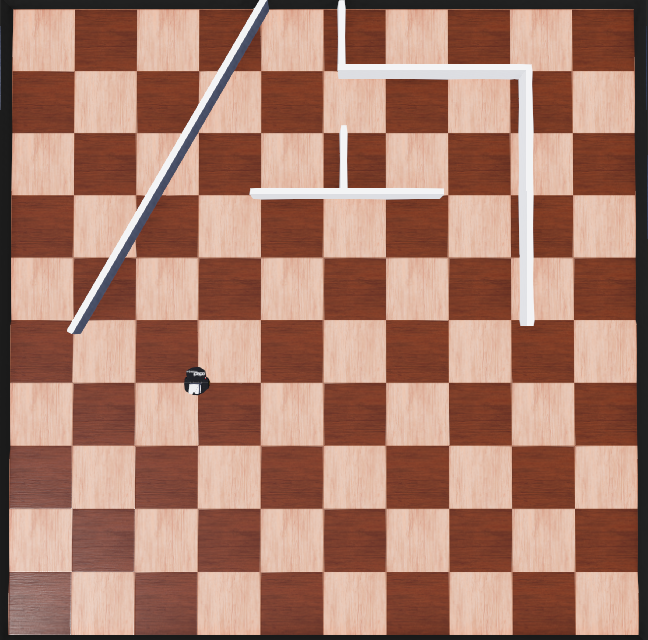
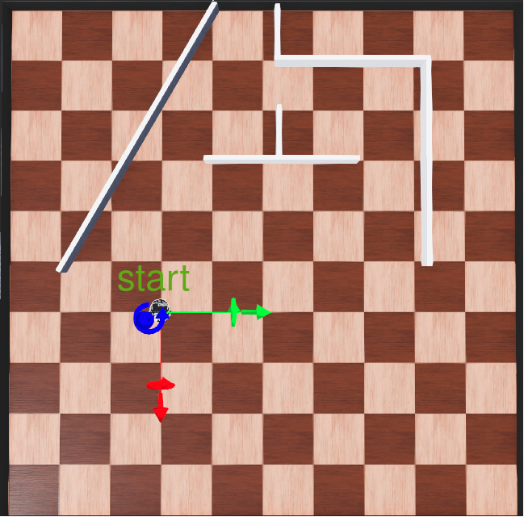
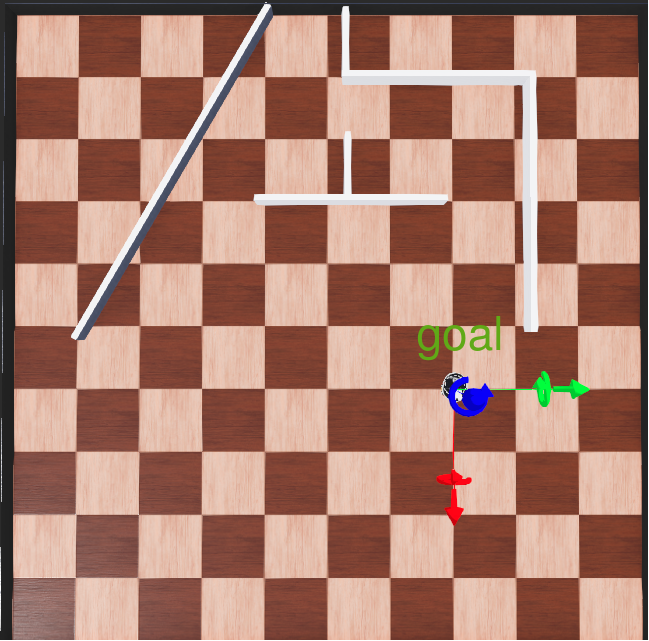
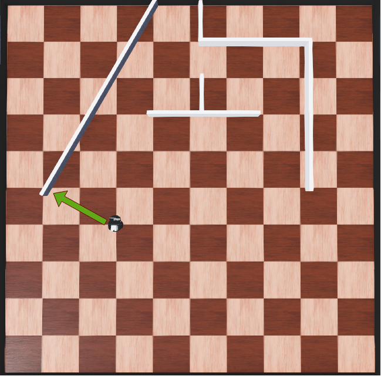
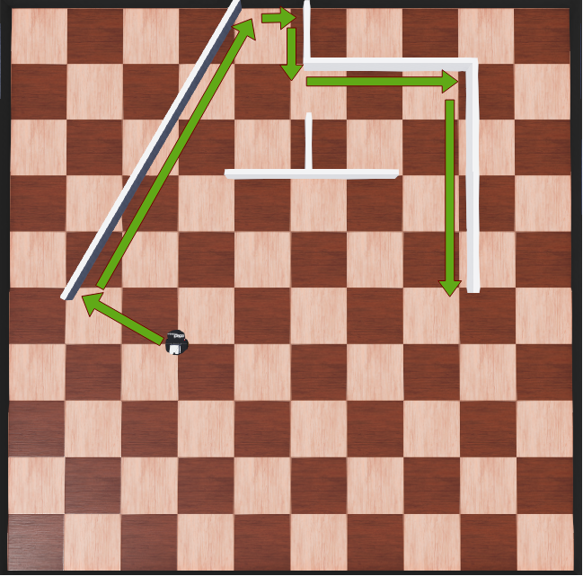

# Individual Assignment: Differential Drive and LiDAR

## Assignment Overview
In this assignment, you will use the Webots simulator to control a Pioneer 3-DX robot. First, you are asked to implement a differential drive controller using the formulas you learned in this module. Second, you have to use the robot's LiDAR to find the closest surface and navigate to it. Finally, you will devise and implement a wall-following algorithm. Before starting with the actual assignment, you should read and follow the instructions in the Preliminaries section in order to familiarize yourself with the simulator.

### Preliminaries (1 hour)

If you have not yet installed the Webots simulator Links to an external site., please do so. We recommend the latest version, 2022b, however, you can also use version 2022a if that works better on your system. Then, follow the official tutorial Links to an external site.(only Tutorial 1) to learn the basics of the simulator. Since you are supposed to use Python for implementing the assignment, please select the corresponding code option in the tutorial. Then, download module2_assignment.zip Download module2_assignment.zip(or module2_assignment_2022a.zip Download module2_assignment_2022a.zipif you are using 2022a), unpack it, and open module2_assignment/worlds/module2_assignment.wbt via File->Open World. You should see a rectangular arena with a Pioneer robot and several walls as shown below:

### Differential drive (3 hours, 10 points)

Implement a differential drive controller to move the robot from the start pose (-1m,2m ,$\pi$ ) to the goal pose (-1m,-2m ,$\pi$ ). In other words, the robot should be translated by  meters along the -axis in world coordinates, as shown below.

<table border="0">
 <tr>
    <td></td>
    <td></td>
 </tr>
</table>

A trivial solution requires three steps to reach the goal, and one step to stop the robot once the goal is reached. Here, a step means setting or changing the pair of wheel velocities. However, it is also possible to reach the goal pose using two steps, and one step for halting. Just reaching the goal will grant you 7 points, by reaching it in two steps you will earn 10 points.

For your code, please create a new controller called "diff_drive", you can use the provided "proxy_controller" as a template. Note that the wheel speed is measured in radians per second, i.e., a velocity of  means that the wheel will make one turn per second. The maximal wheel velocity of the Pioneer 3-DX is 12.3, the wheel diameter is 0.195m, and the distance between the wheels is l = 0.325.

### Closest surface (2 hours, 7 points)

In the second part of the assignment, you should use the robot's LiDAR to find the wall point closest to the robot's start position and then move the robot to that point. For your information, the following image indicates the closest point:

However, in your code this point should be determined from LiDAR data. To that end, please create a new controller called "closest_point". As a template, you can again use the "proxy_controller" which also contains a code snippet for reading LiDAR measurements. The LiDAR has a 180 degrees FoV, a scan contains n = 181 measurements, and the position of the LiDAR in the robot coordinate frame is (x = 0.08m,y = 0m, z = 0.21m ) . The robot should halt  in front of the wall, measured from the center of the robot. Please drive the robot directly to the goal point and do not use the two-step algorithm from the previous part.

### Wall following (2 hours, 3 points)

In the last part, please implement a wall-following algorithm in a new controller called "wall_following". In the first step, the robot should drive to the closest wall, here you can use your results from the previous part. Then, it should drive along that wall as depicted below (the wall should be always left of the robot).

