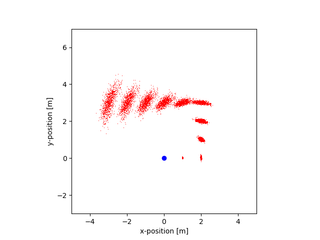
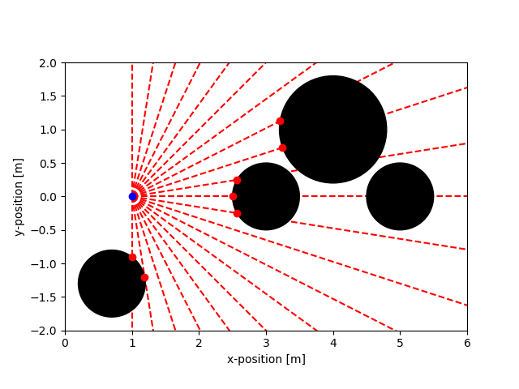

# Individual Assignment: Motion and Sensor Models

## Assignment Overview
In the first part of the assignment, you will implement the sampling algorithm for the odometry-based motion model. In the second part, you are asked to implement a simplified version of the beam-based sensor model.

### Motion Model (2 hours, 10 points)
Implement the sampling algorithm for the odometry-based motion model. To that end, complete the template motion_sampling.py Download motion_sampling.py. First, complete the function sample_normal_distribution(mu, sigma) that draws a random number from a normal distribution with mean mu and standard deviation sigma using the sum-based approach shown on slide 12. Note that on the slides the formula samples from a distribution with zero mean, so you need to add mu to the sum in your implementation. Next, use sample_normal_distribution to implement the sample_motion_model(x, u, a) function as shown on the slides. Here, x, u, and a are numpy arrays with the format x = [x,y,theta] , u = [rot_1,rot_2,rot_3], and alpha = [a1,a2,a3,a4].

The template contains some evaluation code that you do not need to modify. There, the motion sampling function is applied to 1000 samples for ten consecutive steps. The robot starts at the origin and in each step moves one meter along the x-axis in its own frame. In steps three and six it also performs a 90 drgees left turn. If your sampling algorithm is correct, you should see an output similar to the one below:

### Sensor Model (4 hours, 10 points)
In this assignment part, you will implement a simplified version of the beam-based sensor model. First, you will need to implement an algorithm that computes the closest intersection between a beam and a set of circles. Then, you will use the results to calculate the probability of a given range scan.

#### Measurements in a Circle World (6 points)

Assume that the robot lives in a 2D world where all obstacles have a circular form (see figure below). Thus, the map m is an array of circles, each described by a center point (x_c,y_c) and radius r. The robot is equipped with a range scanner that measures the distances to the closest circles, however, the measurements are noisy. In order to apply the beam-based model, you need to compute the expected distance to the closest obstacle for each beam. In a real-world application, this usually would be done with ray tracing, but in the case of circles, the distance can be computed more efficiently. First, you have to find the intersections between one beam and one circle, this article Links to an external site.describes one possible algorithm. Then, you compute the intersections to all circles along the beam and pick the closest one from which you finally derive the expected distance. Note that there might be one, two, or none intersections between one ray and one circle, and that only intersections in front of the robot should be considered. 

Please download sensor_model.zip Download sensor_model.zipand unpack the files in the same directory. The file motion_model.py contains the stubs of the functions that you need to implement along with evaluation code. It also contains the array of circles that define the map, the robot pose, parameter values, and further comments. Complete the function distance_to_closest_intersection which returns the distance between the robot and the closest intersection for one beam. Return infinity if there is no intersection. If done correctly, the script will generate the following graphic, where the blue dot is the robot position, the black circles are the obstacles, the red lines are the beams, and the red dots are the closest intersections. If you cannot solve this assignment part, you can still complete the next part by loading the correct results from z_scan_exp.npy.

Simplified Beam-based Model (4 points)

In the last assignment part, you are asked to implement a simplified beam-based sensor model that only considers measurement noise. In other words, we use P(z|x,m) = P_hit(z|x,m) for a single beam measurement z and ignore the other model components shown in the slides. The expected distance z_exp is obtained by the distance_to_closest_intersection function from the previous part, the variance parameter b is 1 sq cm , and z_max is 10m.  To compute the normalizer eta for each measurement you should use the function normalizer provided in the code. Further, if z > z_max holds, use probability of 1 for that beam.

In motion_model.py, complete the function beam_based_model. As arguments, it takes the array of measurements in the scan (contained in the file z_scan.npy) , an array with the expected measurements, the variance, and z_max. The output is the probability of the complete scan, not just one beam measurement. Since the unit of the variance is centimeters, the measurements and z_max should be converted accordingly before being used in the beam_based_model and normalizer functions, however, the conversion is already implemented in the main function of sensor_model.py.

