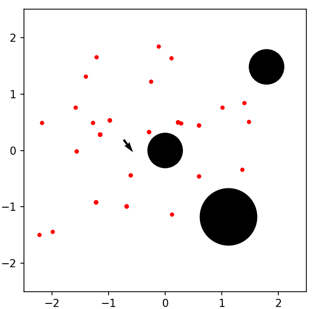

# Individual Assignment: Discrete and Particle Filter

## Assignment Overview
In the course material, it was mentioned that the particle filter is more efficient than the discrete filter. In your own words, briefly justify this statement. Please also find one scenario in which the discrete filter would have an advantage over the basic particle filter.

# Group Assignment: Particle Filter

## Assignment Overview

In this assignment, you have to implement the particle filter localization in the Webots simulator. You are provided with an environment map and parts of the particle filter framework that you need to complete.

This is a group assignment, and all members of a group will receive the same points. So it is important that you share the workload fairly. Whether each member is responsible for one specific implementation part or you work on all parts together, is up to you. Please communicate these issues within the group before you start working. 

### Framework

Please download module5_assignment.zip Download module5_assignment.zip (or module5_assignment_2022a.zip Download module5_assignment_2022a.zip ) and open worlds\module5_assignment.wbt in the simulator. You should see a scene containing a Pioneer robot and three barrel objects as depicted below:

After starting the simulation, you are able to control the robot with the keyboard using the UP, DOWN, LEFT, and RIGHT keys. Note that the simulation window has to be active for that, so you might need to click on it. After moving the robot, a plot should appear that shows the map and the current set of particles as red dots, as depicted below:

The black arrow is the mean pose computed over all particles and represents the estimated robot pose. Since parts of the particle filter are not implemented, the particles in the plot will not have a meaningful behavior yet.

To complete the missing components, open pf_controller.py file in the controllers folder. It already contains the skeleton of the particle filter together with several helper functions. First, have a look at the while-loop in the main() function. The particles and the corresponding importance weights are stored as two separate lists, where each particle is a pose hypothesis with the format [x, y, theta]. Line 423 ensures that the particle filter is updated not in every simulation step but only if the translation of the robot has changed sufficiently. The main reason for that is to keep the simulation interactive since the particle filter update is computationally demanding. The second reason is that we deploy the odometry-based motion model, which might produce inaccurate results for very small translation changes.

The sample_motion_model() function uses the same algorithm that you used in Module 4 and is already implemented. However, you will need to make changes to eval_sensor_model() and resample_particles() as further explained below. Note that in the following, code line numbers refer to the original pf_controller.py file and will change when you modify the file, so it will be helpful to keep a copy of the original file.

### Complete the sensor model (10 points)

We want to deploy the beam-based sensor model that you learned in the last module. Here, the environment consists of circular obstacles and borders around the ground plane. For the beam-based model, we need to compute the expected laser scan measurements for each particle. The intersection between a beam and the obstacles is found in the same way as in Module 4 and is already implemented. However, you have to compute the intersections between the beams and the map borders. To that end, implement the distance_to_closest_border() function in line 206. As arguments, it takes the starting point of a beam (x, y) and its angle theta to the x-axis. The map_limits describes the dimensions of the ground borders as [x_min, x_max, y_min, y_max]. The function should return the distance to the closest intersection of the beam with one of the borders. Since this function is crucial for the rest of the particle filter, please make sure that it works correctly before you proceed with the next part of the assignment.

### Implement particle resampling (10 points)
Next, implement the resample_particles() function in line 328 using the stochastic universal sampling algorithm. It takes a list of particles and the corresponding importance weights as arguments and should return a list of the resampled particles and weights. Here, the weight of a new particle is the same as the weight of the particle from which it was sampled.

### Add random particles (5 points)
After implementing the previous two parts you should obtain a basic particle filter. Run the simulation and move the robot within the map until the filter converges, i.e., until most particles are clustered in one place:

Re-run the simulation several times. You should notice that the filter does not always converge around the true pose of the robot in the simulator. That depends on whether one of the initial particles is close enough to the true pose of the robot. If the particle cluster forms around a wrong pose the algorithm will usually not recover, since there are no alternative hypotheses left that might catch the robot's true pose. There are several approaches for resolving that issue. One straightforward solution is to replace some particles with ones uniformly sampled across the whole map in each filter update step. That guarantees that there will always be alternative hypotheses in the particle set, thus, given enough time, the filter should always converge at the correct pose.

Comment in line 436 that calls the add_random_particles() function and implement it in line 339. Its arguments are the current set of particles, the importance weights, and the map limits. It should return a new set of particles, where half of the original particles with the lowest weights are replaced with randomly sampled particles. Here, you can use the sample_random_particle() function. 

### Odometry from wheel encoders (10 points)

At this point, the odometry is calculated from ground-truth robot poses provided by the simulator. On a real robot, however, you usually would not have that information and odometry would be calculated, e.g., from the readings of wheel encoders. Please replace the get_odometry() function in line 432 with one that computes odometry from the wheel encoder readings of the robot. The odometry output should use the same parametrization as defined in the odometry-based motion model. You can use leftSensor.getValue() and rightSensor.getValue() to obtain the current encoder readings. The returned value is the accumulated rotation of the corresponding wheel in radians since the start of the simulation. For example, a value of 
4π means that the wheel rotated two times forwards and − 4π
indicates that it rotated twice backward. To obtain the robot motion from the encoder readings, you should use the motion equations of the differential drive. Further, assume a wheel diameter of 0.195m and the distance between the wheels to be l = 0.34 m.