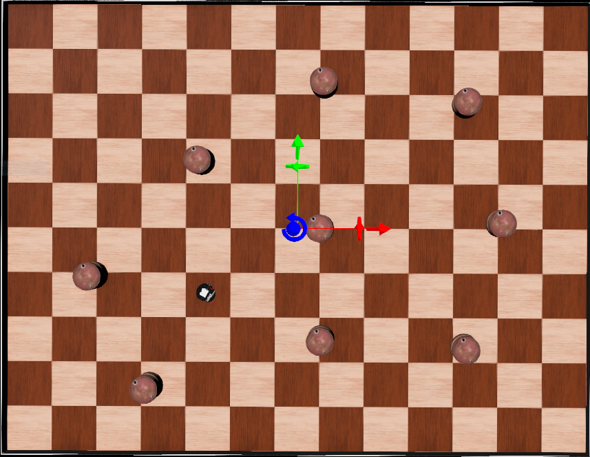
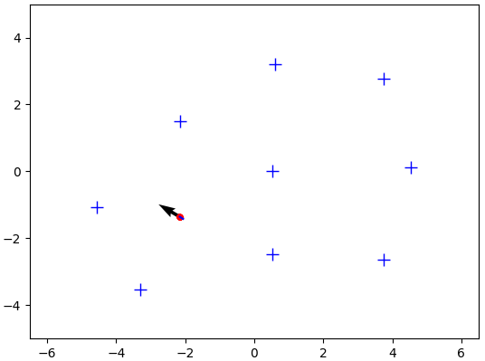
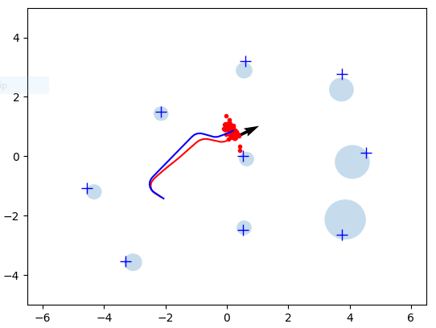

# Assignment: FastSLAM

## Assignment Overview
In this assignment, you need to complete the FastSLAM algorithm in Webots. Similarly to the particle filter exercise, you are provided with a code framework with blanks that you have to fill out.

Here, we consider the landmark-based version of FastSLAM. The robot can sense the landmarks within its proximity whereby the measurements consist of the (noisy) ⟨x,y⟩ distances between the robot and the landmarks. You can further assume known correspondences, i.e., the robot knows what measurement belongs to what landmark.

For this assignment, you can choose whether you would like to submit your answer by yourself or as part of a group.

line-dots-1.png

## Framework
Please download fast_slam.zip Download fast_slam.zip (or fast_slam_2022a.zip Download fast_slam_2022a.zip) and open worlds\fast_slam.wbt in the simulator. You should see an environment as shown below:

Similar to the previous assignment, you can control the robot with the arrow keys. After moving the robot, you should see the following plot:

The black arrow shows the robot pose obtained from the particle with the highest weight. The red dots show the particle, here all particles are initialized with the ground truth robot pose. The blue crosses mark the ground truth landmark positions.

Next, look at slam_controller.py. The main function is almost identical to the one used in the particle filter. However, there are differences in how the particles, measurements, and odometry are modeled. Each particle is a python dictionary where the entries 'x', 'y', and 'theta' represent the pose hypothesis, 'weight' is the importance weight, and 'landmarks' stores a dictionary of the landmark estimates of that particle. The keys in that dictionary are numerical landmark ids 
1,...,M where M is the number of landmarks in the environment. Each landmark is again a dictionary where 'mu' is the mean of the landmark position estimate and 'sigma' the covariance matrix, represented as numpy arrays. Further, the entry 'observed' is a boolean flag that indicates whether the landmark has been observed at least once. 

The measurements are a dictionary with the entries 'id', 'x', and 'y'. The 'id' is a list of landmark ids that were observed at the current time step, 'x' and 'y' are lists of the corresponding distances relative to the robot.

To complete the algorithm, you need to implement the resample_particles() and eval_sensor_model() functions, as explained below.

### Implement particle resampling (5 points)
The resample_particles() method should use the universal stochastic sampling algorithm similar to the standard particle filter. However, you will need to adapt your code to the new particle representation. Further, you have to make sure that when you sample a new particle from the old set you actually create a copy of that particle. Use python's copy.deepcopy() function for that purpose. 

### Implement the sensor model (25 points)
Next, implement the correction step of the FastSLAM algorithm in the eval_sensor_model() method, i.e., lines 4-18 in the algorithm outline on the previous page. There are a few things to notice. First, the landmark measurements are distances relative to the robot, and the landmark poses estimated by the Kalman Filters are in world coordinates. There is no linear transformation that could map between the two spaces. Thus, to be able to apply the KF correction, it is first necessary to convert the raw measured distances dt into global landmark positions. That means that the measurement zi,t as in line 6 of the algorithm should be computed as zi,t = di, t + xt[k] , where you omit the robot orientation in x t[k]. With that, the matrix Ct is simply the two-dimensional identity matrix. Assume further that the measurement noise is independent on the x and y axes with unit variance, i.e., Rt is also an identity matrix. Notice also that not all landmarks are observed at each time step. When a landmark is observed for the first time, you will need to initialize the mean and covariance of that landmark. You can use zi,t for the mean and Rt for the covariance initialization. After initialization, set the 'observed' entry of the landmark to True.

Finally, do not forget to compute new particle weights by evaluating a two-dimensional Gaussian at zi,t, using z^ as mean and Q as covariance (line 12). Further do not forget to normalize the particle weights.

## Expected results 
If implemented correctly, the code should produce an output similar to the one below:

The blue line represents the ground truth trajectory of the robot. The red line shows the trajectory of the particle with the highest weight. The blue circles represent the estimated positions of the landmarks (of the highest-weight particle), where the circle size is proportional to the covariance of the estimate. Since the particle weights are recomputed in each time step, the plot can jitter from step to step.